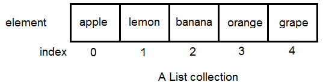
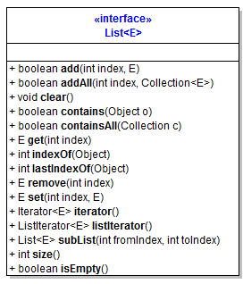
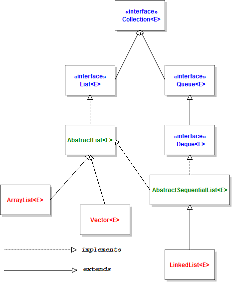

# Java-Collection

## 1. Overview of List Collection

## 2. Creating a new List

## 3. Basic List Operations: adding, retrieving, updating, removing elements.

add(Object)

add(index, Object)

addAll()

remove(Object)

clear()

## 4. Iterating over elements in a List

Loop - forEach

Using Iterator

forEach + Lambda

## 5. Searching for an element in a List

contains

indexOf

lastIndexOf

## 6. Sorting a List

implement Interface compareTo()

## 7. Copying Elements from one list into another

## 8. Shuffling elements in a list

## 9. Reversing elements in a List

## 10. Extracting a portion of a List

## 11. Converting between Lists and Arrays

## 12. List to Stream

## 13. Concurrent Lists

## Reference Document

[So sánh ArrayList, Array, LinkedList, Vector](https://tunghuynh.net/programer/java/2164/java-phan-10-so-sanh-array-vs-arraylist-vs-linkedlist-vs-vector/)

[Java List Collection Tutorial and Example](https://www.codejava.net/java-core/collections/java-list-collection-tutorial-and-examples)

