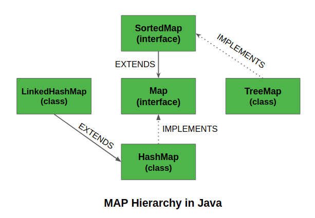

# Map Interface in Java

## Method in Map Interface

| Method | Action Performed | Example |
| :--- | :--- | :--- |
|clear() | This method is used to clear and remove all of the elements or mappings from a specified Map collection.||
|containsKey() | 
|containsValue()|
|entrySet()|
|equals(Object)|
|get(Object)|
|hashCode()|
|isEmpty()|
|keySet()|
|put(Object, Object)|

## Map Hierarchy in Java

## Performing Various Operations using Map Interface and HashMap Class:

1. Adding Elements

2. Changing Elements

3. Removing Elements

4. Iterating through the Map

5. Copy Elements

6. Clone a Map

7. Sort element of Map

8. Concat of many Map

