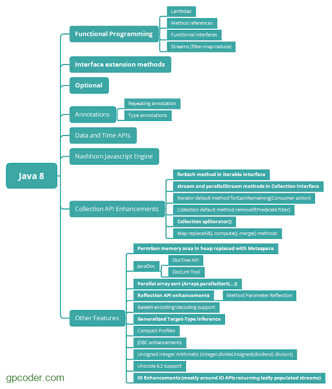

## Hướng dẫn thực hành với Lambda

### Java Lambda Expressions
    parameter -> expression
    (parameter1, parameter2) -> expression
    (parameter1, parameter2) -> { code block }

### Using Lambda Expressions
    1. Function Interface
        + Single Abstract Method - SAM -> Chứa một và chỉ một method abstract
            @FunctionalInterface
        + Một trong các ứng dụng quan trong của Lambda Expression để tạo ra
        thể hiện (instance) cho chính interface đó.
        
    2. Toán tử mũi tên
        (->) chia biểu thức Lambda thành 2 phần: tham số và nội dung thực thi.
        (int a, int b) -> { do something };
    3. What? Why?
        + anonymous function
        + filter, try xuất dữ liệu
        + hỗ trợ thực hiện: tuần tự: Sequential và song song Parallel.
            Stream API.

    4. Syntax of Lambda
        (argument-list) -> {body}
        Biểu thức lambda trong java có 3 thành phần chính:
        + argument-list: Danh sách tham số, có thể có hoặc không, có một hoặc nhiều tham số.
            Danh sách tham số: danh sách tham số có trong FunctionalInterface
            Interface chỉ chứa một và chỉ một method abstract
        + arrow-operator: toán tử mũi tên được sử dụng để liên kết danh sách tham số và body của biểu thức.
        + Body: nội dung thực thi, là một khối lệnh hoặc một biểu thức.

        
    5. Ứng dụng của Lambda
        + Implement Function Interface:
        + Làm việc với Collection
            -> Lambda vào còng forEach
        + Anonymous inner class.
            -> Comparator
        + 
    6. Note of Lambda

### Reference Document
    1. Java Lambda
       https://www.w3schools.com/java/java_lambda.asp
    2. Nắm rõ JAVA LAMBDA Expression cho người mới bắt đầu
        https://viblo.asia/p/nam-ro-java-lambda-expression-cho-nguoi-moi-bat-dau-RQqKLNwbl7z
    3. Functional Interface trong Java 8
        https://gpcoder.com/3869-functional-interface-trong-java-8/
    4. Biểu thức Lambda trong Java 8 - Lambda Expression
        https://gpcoder.com/3898-bieu-thuc-lambda-trong-java-8-lambda-expressions/

### Giới thiệu java 8

    1. Giới thiệu Java 8
    2. Một vài ví dụ về cách sử dụng java 7 so với Java 8
        2.1. sort trong Java 7 và java 8
        2.2. lọc
    3. MỘt số bài hay

### Interface trong Java 8 - Default method và Static mehtod
    1. Phương thức default trong Interface - Default method
        1.1. Giới thiệu
        1.2. Điều gì sảy ra khi có đa thừa kế
        1.3. Tóm tắt một số đặc điểm quan trong về default methods trong interface

    2. Phương thức static trong Interface - Static method
    3. Nhìn lại Abstract classes vs Interface trong Java 8

### Functional Interface trong Java 8

### Phương thức tham chiếu trong Java 8 - Method Reference

### Biểu thức Lambda trong Java 8 - Lambda Expression

### Phương thức forEach() trong java 8

### Giới thiệu về Stream API trong Java 8

### Optional trong java 8

### Predicate trong Java 8

### Consumer trong java 8

### Supplier trong Java 8

### Function trong Java 8

### Lớp Collection trong Java 8

### Sắp xếp trong Java 8

### Date Time trong Java 8

### Annotation trong Java 8

### Lập trình đa luồng với CompletableFuture trong java 8

### String Joiner trong Java 8

### Base 64 Encoding và Decoding trong Java 8

### Thực thi nhiều tác vụ cùng một lúc như thế nào trong Java

### Loại bỏ các phần từ trùng nhau trong một ArrayList như nào trong Java 8

### Tìm hiểu cơ chế Lazy Evaluation của Stream trong Java 8

### Refactoring Design Pattern với tính năng mới trong java 8

