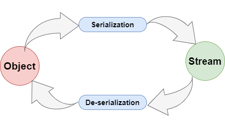

## Java Serializable là gì? Serialization và Deserialization trong Java

### 1. Java Serializable là gì?

1.1. Serializable trong Java là gì?

Quá trình Serialization chuyển đổi giữa Object và byte stream giữa các module vận hành hoàn toàn độc lập với bất cứ nền tảng nào.

1.2. Interface java.io.Serializable là gì?
	
1.3. Tại sao nên sử dụng Serializable?

### 2. Tại sao cần Serialization?
    Dữ liệu chuyển đổi qua lại với nhau bằng byte chứ không phải là object.
    -> Cần một cơ chế để có thể hiểu qua lại giữa việc gửi và nhận này.
    + Quá trình serilization hoàn toàn độc lập với platform -> không phụ thuộc vào hệ điều hành.
        -> chuyển đổi giữa byte và Object các module.

### 3. Coding:
    Object -> ghi ra file
    file -> reading -> Object/Module

### 4. Một số lưu ý về Serialization trong Java:

4.1. Những câu hỏi thường gặp về Serializable trong Java

### 5. Ví dụ về Serializable trong Java:

5.1. Khi nào một class được xem là Serializable thành công?

Để một class được xem là Serializable thành công, class sẽ cần phải đáp ứng đầy đủ 2 điều kiện sau:
+ Class phải được implement interface java.io.Serializable
+ Tất cả các field trong class sẽ cần phải Serializable.

	
5.2. Serializing một Object

Thực hiện việc ghi gữ liệu vào file, mục đích để dùng cho mục đích đọc xử lý nghiệp vụ nào đó.
	
5.3. Deserializing một Object
	
Từ các file dữ liệu đó, sẽ readData -> convert thành đối tượng Object mong muốn.

5.4. Những lưu ý về Serializable trong Java

+ Nếu class mẹ đã implement Serializable, class con sẽ không cần phải thực hiện implement Serializable lần nữa. (Coding demo)
+ Ngoài thuộc tính transient không thể Serialization còn có thuộc tính static.
    + các thuộc tính transient là gì?
    + các thuộc tính static là gì?
    
+ Hàm Constructor - hàm khởi tạo sẽ không được gọi nếu một Object được Deserialization.

+ Nếu bạn muốn Serializable một Object, toàn bộ thuộc tính trong Obejct đó đều phải Serializable.
    + Ví dụ thuộc tính Address của Object Customer phải implement Serializable. Nếu không khi Serialization Object Customer, Java sẽ báo lỗi: java.io.NotSerializableException.

### 6. Reference Document:
+ [Java Serializable là gì?](https://stackjava.com/java/java-serializable-la-gi-serialization-va-deserialization-trong-java.html)

+ [Java Tutorial](https://docs.oracle.com/javase/tutorial/jndi/objects/serial.html)

+ [Write Read Arraylist Object File Java](https://samderlust.com/dev-blog/java/write-read-arraylist-object-file-java)

+ [Tìm hiểu về Serializable trong Java](https://wiki.tino.org/tim-hieu-ve-serializable-trong-java/)

