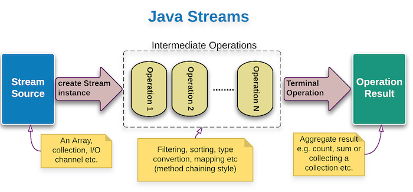

# Java Stream

Stream là một đối tượng mới của Java được giới thiệu từ phiên bản Java 8, giúp cho việc thao tác
trên collection và array trở nên dễ dàng và tối ưu hơn.

Để giúp các bạn có những kiến thức vững chắc về đối tượng Stream trong Java, Hướng Dẫn Java đã có
những bài viết về nó.

Các bạn có thể bắt đầu với bài
viết [Giới thiệu về Stream trong Java](https://huongdanjava.com/vi/gioi-thieu-ve-stream-trong-java.html)
, rồi sau đó có thể tìm hiểu sâu về đối tượng Stream này.

+ [Group by các phần tử trong List sử dụng Stream và Collectors trong Java](https://huongdanjava.com/vi/group-by-su-dung-stream-va-collectors-trong-java.html)

Sử dụng Stream và Collectors object từ Java 8, chúng ta có thể group by các phần tử trong List giống
như trong database.

+ [Sử dụng phương thức flatMap() của đối tượng Stream trong Java](https://huongdanjava.com/vi/su-dung-phuong-thuc-flatmap-cua-doi-tuong-stream-trong-java.html)

Trong bài viết này, mình sẽ hướng dẫn các bạn làm thế nào để sử dụng phương thức flatMap() của đối
tượng Stream trong Java.

## Reference document:

+ [Giới thiệu về Stream API trong Java 8](https://gpcoder.com/3923-gioi-thieu-ve-stream-api-trong-java-8/)

